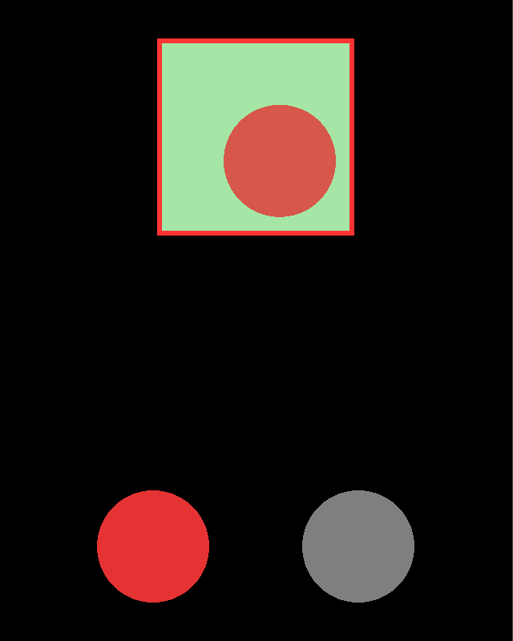

# dmc-dragdrop

Drag and drop for Solar2D (formerly Corona SDK): drag something from one place on the screen and drop it on another, with each drop area deciding what it accepts.

One Drag Manager coordinates every drag in the app. Start a drag from any touch, and register the areas things can be dropped on; the manager moves a stand-in under the finger and tells each area what is happening:

```lua
local DragMgr = require 'dmc_corona.dmc_dragdrop'

DragMgr:register( basket, {
	dragEnter = function( event )
		if event.format == 'fruit' then DragMgr:acceptDragDrop() end
	end,
	dragDrop = function( event ) print( 'in the basket:', event.data ) end,
})

-- in a touch listener, on 'began'
DragMgr:doDrag( apple, event, { format='fruit', data='apple' } )
```

It is modeled on the Adobe Flex Drag Manager.

## Features

- Start a drag from any display object's touch listener with one call, `doDrag()`
- A drag proxy follows the finger: a grey square by default, or any display object you give it
- Drop targets are plain display objects, or [dmc-objects](https://github.com/dmccuskey/dmc-objects) components
- Six events for each drop target: `dragStart`, `dragEnter`, `dragOver`, `dragExit`, `dragDrop`, `dragStop`, as callbacks or as the target's own methods
- Each target decides what it accepts, from a `format` string and any `data` you pass along
- The proxy shrinks into the target on a drop, or slides back where it came from
- Several drags at once, one per finger, with multitouch on
- Pure Lua, no plugins needed; MIT licensed

## Quick Start

The following code will get you up and running in about 10 minutes in the Solar2D Simulator on macOS or Windows. It makes a square you can drop things on, then a basket that takes an apple but not a rock.

Prerequisites: the [Solar2D](https://solar2d.com/) Simulator and a copy of this repository (`git clone https://github.com/dmccuskey/dmc-dragdrop.git`, or download the ZIP from GitHub).

### 1. Copy the Library into Your Project

Copy these from this repository into the root of your project folder:

```text
dmc_corona_boot.lua     loader for the DMC libraries
dmc_corona.cfg          configuration
dmc_corona/             dmc-dragdrop and the libraries it uses
```

**Going further:** keep the libraries in a subfolder, or combine several DMC libraries ([dmc-corona-boot Configuration](https://github.com/dmccuskey/dmc-corona-boot/blob/master/docs/configuration.md)).

### 2. Drag and Drop

Create `main.lua` in the project folder:

```lua
local DragMgr = require 'dmc_corona.dmc_dragdrop'

local W, H = display.contentWidth, display.contentHeight

-- the drop target: where things can be dropped
local target = display.newRect( W/2, H*0.3, 240, 240 )
target:setFillColor( 0.35, 0.65, 1 )

DragMgr:register( target, {
	dragEnter = function( event )
		DragMgr:acceptDragDrop()  -- without this, nothing can be dropped here
		target:setFillColor( 0.65, 0.9, 0.65 )
	end,
	dragExit = function( event )
		target:setFillColor( 0.35, 0.65, 1 )
	end,
	dragDrop = function( event )
		target:setFillColor( 0.35, 0.65, 1 )
		print( 'dropped' )
	end,
})

-- the drag initiator: touch it to start a drag
local item = display.newRect( W/2, H*0.75, 140, 140 )
item:setFillColor( 1, 0.5, 0.3 )

item:addEventListener( 'touch', function( event )
	if event.phase == 'began' then
		DragMgr:doDrag( item, event )
	end
	return true
end )
```

Open the project in the Simulator and drag the orange square. A see-through grey square, the drag proxy, follows the mouse; the orange one stays where it is. Over the blue target, the target turns green. Let go there: the proxy shrinks into the target and the console shows:

```text
dropped
```

Let go anywhere else, and the proxy slides back to the orange square.

If the console shows `module 'dmc_corona.dmc_dragdrop' not found` instead, `dmc_corona/` is missing from the root of the project folder. `The module 'dmc_objects' not found` means `dmc_corona.cfg` is missing there.

### 3. Accept Only Some Drags

Replace `main.lua` with this. Each item now says what it is, with a `format` and some `data`, and brings its own proxy; the basket accepts only fruit:

```lua
local DragMgr = require 'dmc_corona.dmc_dragdrop'

local W, H = display.contentWidth, display.contentHeight
local BLUE, GREEN, GREY = { 0.35, 0.65, 1 }, { 0.65, 0.9, 0.65 }, { 0.7 }

-- the drop target takes only fruit
local basket = display.newRect( W/2, H*0.3, 240, 240 )
basket:setFillColor( unpack( BLUE ) )
basket.strokeWidth = 6
basket:setStrokeColor( unpack( GREY ) )

DragMgr:register( basket, {
	dragStart = function( event )
		if event.format == 'fruit' then basket:setStrokeColor( 1, 0.2, 0.2 ) end
	end,
	dragEnter = function( event )
		if event.format == 'fruit' then
			DragMgr:acceptDragDrop()
			basket:setFillColor( unpack( GREEN ) )
		end
	end,
	dragExit = function( event )
		basket:setFillColor( unpack( BLUE ) )
	end,
	dragDrop = function( event )
		basket:setFillColor( unpack( BLUE ) )
		print( 'in the basket:', event.data )
	end,
	dragStop = function( event )
		basket:setStrokeColor( unpack( GREY ) )
	end,
})

-- drag initiators, each with its own format, data and proxy
local function newItem( x, color, format, data )
	local item = display.newCircle( x, H*0.75, 70 )
	item:setFillColor( unpack( color ) )

	item:addEventListener( 'touch', function( event )
		if event.phase == 'began' then
			local proxy = display.newCircle( 0, 0, 70 )
			proxy:setFillColor( unpack( color ) )
			DragMgr:doDrag( item, event, {
				proxy=proxy, format=format, data=data, alpha=0.8
			} )
		end
		return true
	end )
end

newItem( W*0.3, { 0.9, 0.2, 0.2 }, 'fruit', 'apple' )
newItem( W*0.7, { 0.5, 0.5, 0.5 }, 'rock', 'granite' )
```

The Simulator restarts the app when the file is saved. Drag the red apple: as the drag starts, the basket gets a red outline (it will take this), and it turns green when the apple is over it. Drop it there, and the console shows `in the basket:	apple`. Drag the grey rock: the basket doesn't react, and the rock slides back when you let go.



`dragStart` and `dragStop` go to every target at the start and end of each drag, so a target can show whether it takes this one. `dragEnter` is where a target accepts a drag: only then does it get `dragOver`, `dragExit` and `dragDrop` ([The Drag and Drop Cycle](docs/using-dragdrop.md#the-drag-and-drop-cycle)).

**Going further:** make a drop target its own class, with the events as methods ([Drop Targets as Objects](docs/using-dragdrop.md#drop-targets-as-objects)), or see complete apps in [examples](examples/).

To update, copy `dmc_corona_boot.lua` and `dmc_corona/` again from the newer version. Keep your own `dmc_corona.cfg` if you have changed it.

## Documentation

- [Using dmc-dragdrop](docs/using-dragdrop.md): initiators, proxies and drop targets, the drag and drop cycle, formats and data, drop targets as objects
- [API reference](docs/api.md): `doDrag()`, `register()`, `acceptDragDrop()`, the events, configuration, known issues
- [Examples](examples/): a basic drop target with a score, and drop targets as dmc-objects classes that accept different formats
- [Changelog](CHANGELOG.md)

Everything else is listed on the [documentation home](docs/README.md).

## License

dmc-dragdrop is released under the [MIT License](LICENSE).
