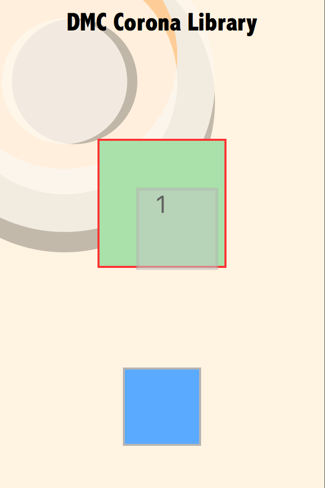
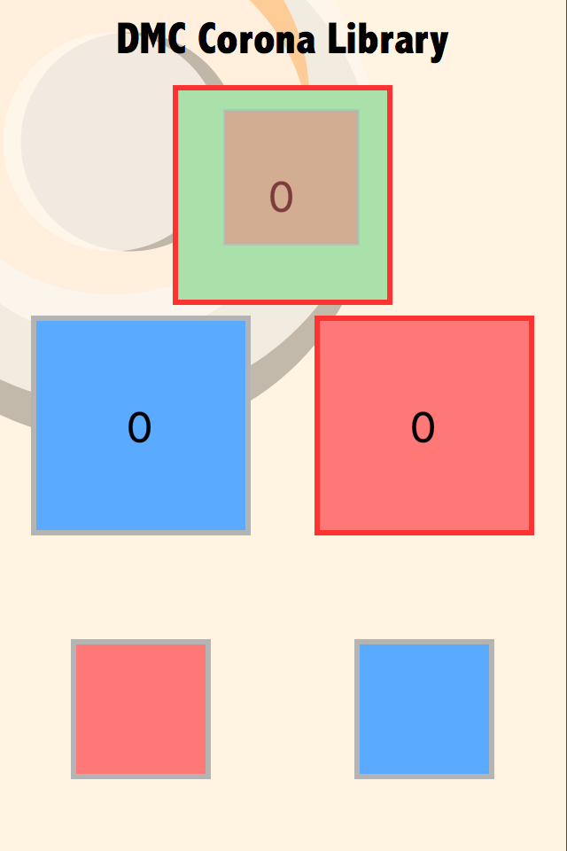

# Examples

Each folder is a complete Solar2D project with its own copy of the library: open its `main.lua` in the Solar2D Simulator. In both, drag a square from the bottom of the screen onto a target above: each drop the target accepts adds one to its score. The screenshots show a drag in progress (scripted, for the picture).

| | |
|---|---|
|  | **dmc-dragdrop-basic**: one drop target, a plain display object, with a handler for each of the six events: a red outline while any drag is on (`dragStart`, `dragStop`), green while a drag is over it (`dragEnter`, `dragExit`), and the score on `dragDrop`. The drag uses the default grey proxy. After 10 seconds the app unregisters the target (the console shows `Unregistering drop target`), and it stops reacting; a drag held over it then carries on as if over nothing. |
|  | **dmc-dragdrop-oop**: three drop targets made from one [dmc-objects](https://github.com/dmccuskey/dmc-objects) class, `drop_target.lua`, with the events as methods ([Drop Targets as Objects](../docs/using-dragdrop.md#drop-targets-as-objects)). The red and blue squares start drags with the format `red` or `blue` and their own proxy, drawn 30 points above the finger. The blue target accepts `blue`, the red one `red`, the grey one both. |
